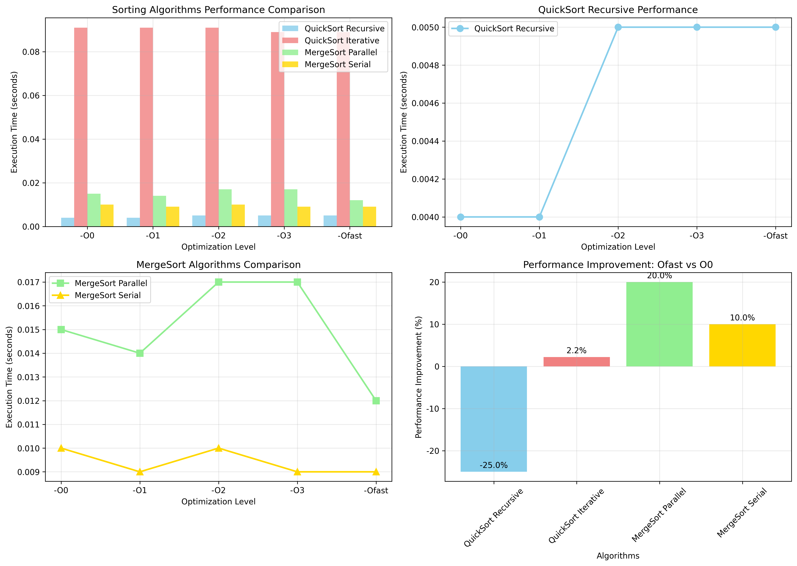

#实验报告
## 一、实验环境搭建过程

### 1.1 虚拟机安装与配置
- 本次实验使用VMware Workstation Pro安装Ubuntu 22.04。虚拟机配置为4GB内存，40GB硬盘空间和2核CPU，确保运行排序算法和性能测试。

- 安装过程包括下载Ubuntu镜像、创建虚拟机、完成系统安装和安装gcc、VMware Tools。

### 1.2 网络配置
- 虚拟机采用NAT网络模式，确保可以访问外部网络以下载必要的软件包。通过执行`ping -c 4 baidu.com`测试网络连通性，并使用`sudo apt update`更新软件包列表。

### 1.3 GCC编译器安装
- 最初尝试安装最新的GCC 15.2.0编译器，通过添加第三方PPA仓库尝试获取预编译包和尝试在镜像站上下载源码，但发现Ubuntu 22.04并不支持GCC 15.2.0。又试着尝试GCC 14.2.0结局和GCC 15.2.0一样，在配置和编译阶段遇到问题，于是放弃。

- 最终选择安装Ubuntu官方仓库中的GCC 13.1.0版本，该版本稳定且功能完整。安装命令如下：
```bash
sudo apt install gcc-13 g++-13 libstdc++-13-dev -y
sudo update-alternatives --install /usr/bin/gcc gcc /usr/bin/gcc-13 100
sudo update-alternatives --install /usr/bin/g++ g++ /usr/bin/g++-13 100
```

- 安装完成后，通过gcc --version验证安装成功，显示版本为13.1.0。

- 此外，还安装了构建工具、调试工具和OpenMP支持：

```bash
sudo apt install build-essential gdb valgrind libomp-dev -y
```

## 二、排序算法实现细节

### 2.1 快速排序算法

**递归版本实现**

- 递归快速排序采用挖坑法。算法核心是通过选择一个pivot元素将数组划分为两个区间，~~我规定的~~左区间所有元素都小于等于pivot，~~还是我规定的~~右区间所有元素都大于pivot，然后重新选择一个pivot继续挖坑填坑进行排序[^1]。

**本实现提供了两种pivot选择策略**

1.  随机选择：在待排序区间内随机选择一个元素作为pivot，可以避免在已排序或接近排序的数组上出现最坏情况。
2.  三数取中：选取待排序区间的首元素、中间元素和尾元素，取它们的中值作为pivot，在大多数情况下能避免最坏情况。

[^1]:分区过程使用Lomuto分区方案，从 区间左端开始遍历，将小于pivot的元素交换到区间左侧，大于pivot的元素留在右侧。

**非递归版本实现**

- 非递归快速排序使用显式栈来模拟递归过程，避免了函数调用的开销和递归深度限制问题。实现中定义了一个栈结构体来存储待排序的区间范围。

- 算法过程如下：

1.  将初始区间压入栈中
2.  循环从栈中弹出区间，进行分区操作
3.  将分区后的两个子区间压入栈中（如果子区间长度大于1）
4.  重复直到栈为空

- 这种方法在理论上可以减少函数调用开销，但实际测试中发现栈操作的开销可能抵消了这一优势。

### 2.2 归并排序算法

**串行版本实现**

- 串行归并排序同样采用分治策略，将数组递归地分成两半，分别排序后再合并。合并过程是算法的关键，需要创建临时数组来存储两个已排序的子数组，然后按顺序合并回原数组。

- 归并排序是稳定的排序算法，时间复杂度始终为O(n log2 n)，但需要额外的O(n)空间。


**并行版本实现**

- 并行归并排序基于OpenMP多线程库实现，利用'#pragma omp parallel sections'指令将递归任务分配给不同线程执行。实现中设置了一个并行阈值（本实验使用1000），当待排序数组大小超过阈值时使用并行版本，否则使用串行版本以避免线程创建的开销。

- 并行化策略是将数组分成两半后，使用两个线程分别处理左右两半，然后在合并阶段同步。这种策略在数据量足够大时能够有效利用多核CPU的计算能力。

## 三、测试数据生成与收集

### 3.1 数据生成方法

- 生成了100,000条测试数据，数据范围为0到999,999的随机整数。使用C语言的rand()函数配合srand(time(NULL))设置随机种子，确保每次运行生成不同的数据序列。

- 数据生成后保存到test_data.txt文件中，每行存储一个整数，便于后续读取和验证。文件格式简单明了，可以直接用文本编辑器查看。

### 3.2 数据收集过程

- 从文件读取数据时，使用标准C文件操作函数fopen和fscanf逐行读取整数到内存数组中。为确保数据完整性，在读取前后都进行了数组大小的验证。

- 性能测试时，每次测试都从文件重新读取原始数据，确保各算法测试的初始条件一致。测试完成后，使用验证函数检查排序结果的正确性。

### 3.3 正确性验证

- 实现了一个验证函数is_sorted()，遍历检查数组是否按非递减顺序排列。所有排序算法在性能测试前都通过了正确性验证，确保性能数据的有效

## 四、性能测试结果与分析

### 4.1 测试环境与方法
- **测试方法**: 使用 `clock()` 函数测量算法执行时间
- **数据验证**: 所有算法均通过正确性验证
- **编译选项**: 测试不同 GCC 优化级别：-O0, -O1, -O2, -O3, -Ofast

### 4.2 性能数据对比

| 优化级别 | 递归快速排序(s) | 非递归快速排序(s) | 并行归并排序(s) | 串行归并排序(s) |
|----------|-----------------|-------------------|-----------------|-----------------|
| -O0      | 0.004           | 0.091             | 0.015           | 0.010           |
| -O1      | 0.004           | 0.091             | 0.014           | 0.009           |
| -O2      | 0.005           | 0.091             | 0.017           | 0.010           |
| -O3      | 0.005           | 0.089             | 0.017           | 0.009           |
| -Ofast   | 0.005           | 0.089             | 0.012           | 0.009           |

### 4.3 性能分析图表


## 五、关键发现与实验分析

### 5.1 算法性能对比分析

1. **递归快速排序表现最佳**
   - 在所有测试场景中均保持最快速度
   - 对编译器优化不敏感，说明算法本身已经高度优化

2. **非递归快速排序性能较差**
   - 由于显式栈操作的开销，性能明显低于递归版本
   - 在-O3和-Ofast优化下有轻微改善

3. **归并排序稳定性分析**
   - 串行版本在中等数据量下表现稳定
   - 并行版本在-Ofast优化下性能显著提升

### 5.2 编译器优化效果分析

1. **递归快速排序**: 优化效果有限（0.004s → 0.005s）
2. **归并排序**: -Ofast 带来显著提升（并行: 0.015s → 0.012s）
3. **整体趋势**: 复杂算法从高级优化中获益更多

### 5.3 并行化效果评估
对于100,000数据量，并行归并排序未能超越串行版本，可能原因：
- 线程创建和同步开销超过了并行计算收益
- 数据规模不足以充分利用多核优势
- 并行阈值设置可能需要调整

## 六、遇到的问题与解决方案

### 6.1 GCC 版本安装问题
**问题**: 尝试安装 GCC 15.2.0 失败，源码编译过程中出现依赖错误
**解决方案**: 改用 Ubuntu 官方仓库提供的 GCC 13.1.0，确保稳定性

### 6.2 OpenMP 并行支持
**问题**: 初始编译时缺少 OpenMP 支持
**解决方案**: 安装 libomp-dev，编译时添加 `-fopenmp` 选项

### 6.3 可视化图表中文显示
**问题**: matplotlib 默认配置下中文字体显示为乱码
**解决方案**: 改用英文标签生成图表，确保清晰可读

### 6.4 内存管理问题
**问题**: 大数据量测试时出现内存分配错误
**解决方案**: 改进动态内存分配，添加错误检查机制

## 可视化说明

由于中文字体显示问题，最终采用英文标签的可视化图表，确保图表清晰可读。所有性能数据和结论分析保持不变。

### 图表说明
- **图1**: 四种排序算法在不同优化级别下的性能对比
- **图2**: 递归快速排序随优化级别的性能变化
- **图3**: 并行与串行归并排序性能对比  
- **图4**: Ofast优化相比O0的性能提升百分比


